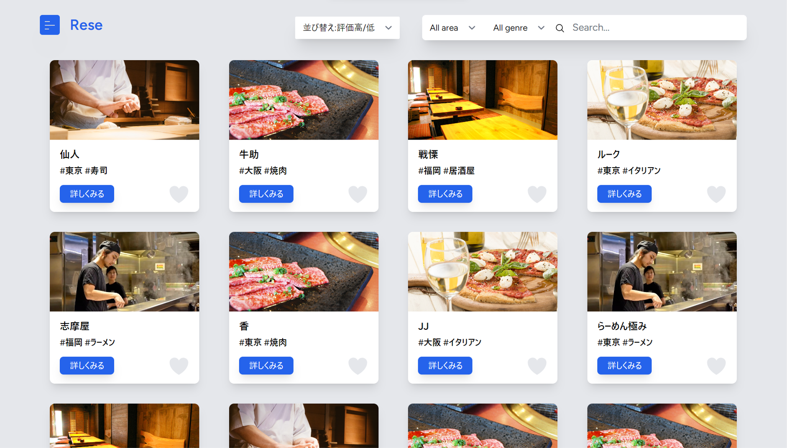
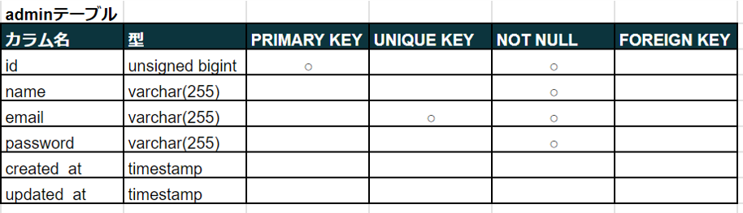
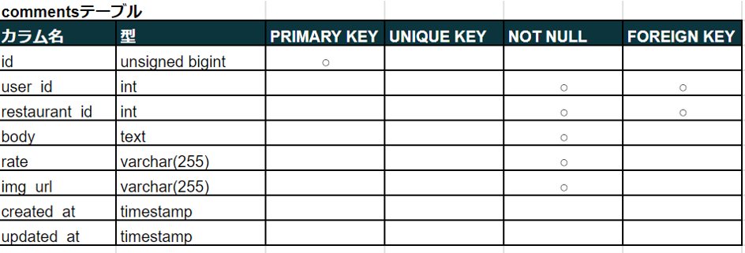
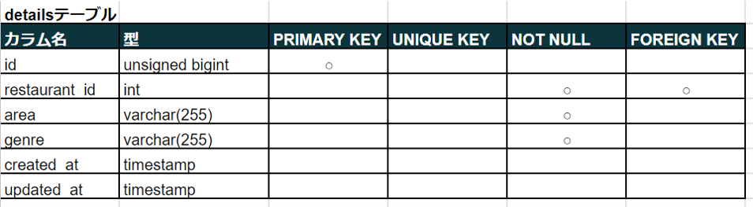
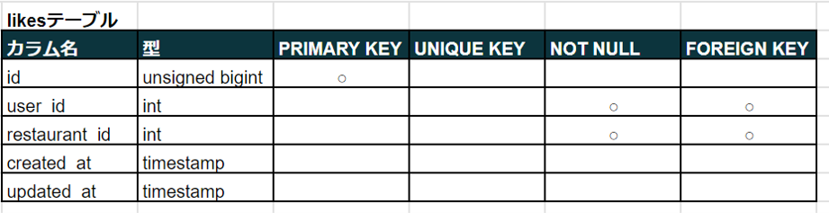
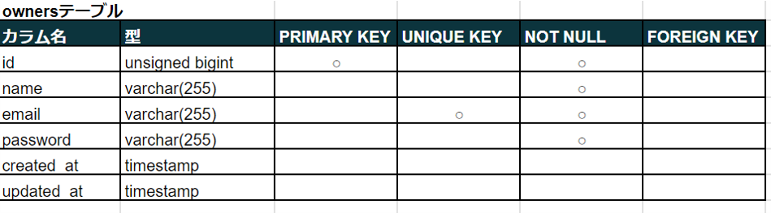
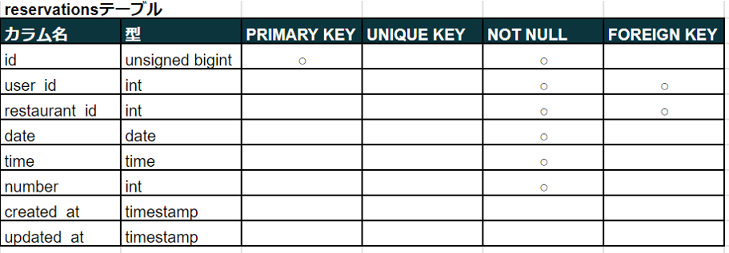
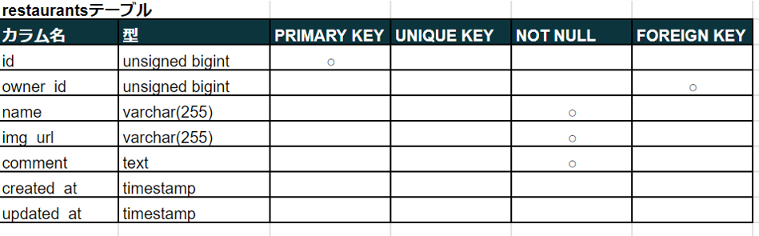
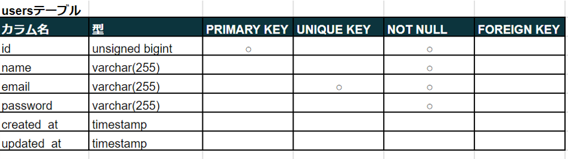
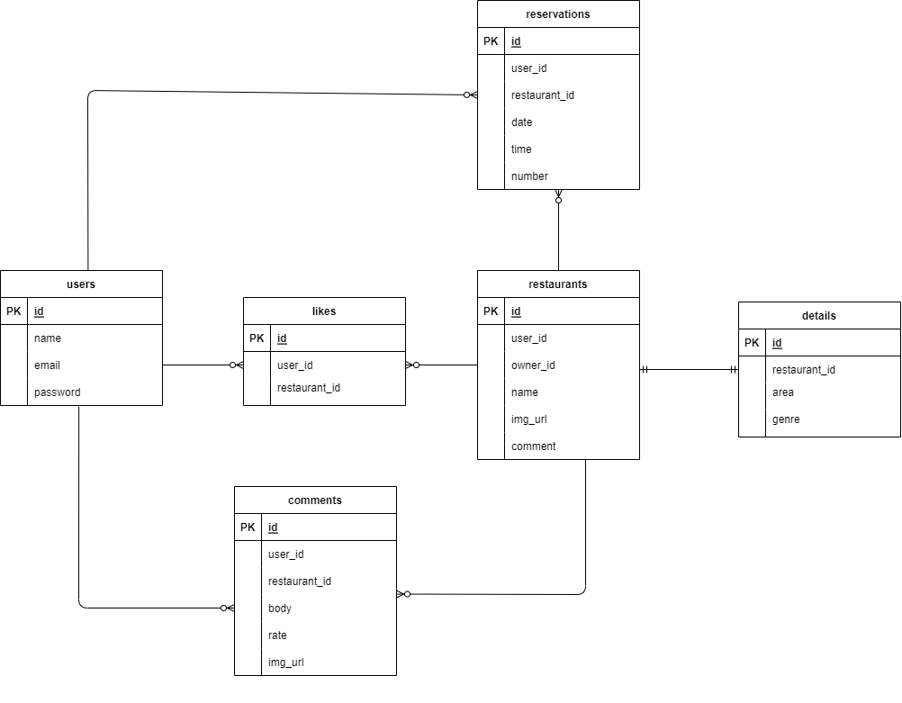

# Rese
ある企業のグループ会社の飲食店予約サービス


## 作成した目的
外部の飲食店予約サービスは手数料を取られるので自社で予約サービスを持ちたい。

## 機能一覧
### ユーザ画面
- 会員登録
- ログイン
- ログアウト
- ユーザ情報取得
- ユーザお気に入り情報取得
- ユーザ予約情報取得
- 飲食店一覧取得
- 飲食店詳細取得
- 飲食店予約
- 飲食店予約変更
- 飲食店お気に入り追加
- 飲食店お気に入り削除
- エリア検索
- ジャンル検索
- 店名検索
- コメント追加
- コメント削除
- コメント編集
- ランダムソート
- 評価順ソート

### 管理画面
admin: 管理ユーザー  
owner: 店舗ユーザー
- ログイン(owner, admin)
- ログアウト(owner, admin)
- 飲食店一覧取得(owner, admin)
- 飲食店詳細取得(owner, admin)
- 飲食店情報変更(owner, admin)
- 予約確認(owner, admin)
- コメント確認(owner, admin)
- コメント削除(admin)
- 飲食店追加(owner, admin)

### 飲食店追加方法
csvファイルに店舗名、エリア、ジャンル、店舗概要、画像URLの順に記述する
```
"店舗名", "エリア", "ジャンル", "店舗概要", "画像URL"
```
- 項目はすべて必須
- 店舗: 50文字以内
- 地域: 「東京都」「大阪」「福岡」のみ
- ジャンル: 「寿司」「焼肉」「イタリアン」「居酒屋」「ラーメン」のみ
- 店舗概要: 400文字以内
- 画像URL：jpeg、pngのみアップロード可能

## 使用技術（実行環境）
- Laravel 9.x
- Blade
- tailwindcss
- alpinejs

## テーブル設計
















## ER図


## 環境構築
### 開発環境構築
プロジェクトフォルダ内で以下を実行
```
composer install
```
設定ファイルの作成と編集
```
cp .env.example .env
php artisan key:generate
php artisan config:clear
```
シンボリックリンクを設定する
```
php artisan storage:link
```
フロントエンドのビルド
```
npm install
npm run dev
```
データベースの作成、データ挿入
```
php artisan migrate --seed
```
***
### 管理画面ログイン情報
#### 店舗ユーザー
- email: owner1@example.com
- password: password
- email: owner2@example.com
- password: password
- email: owner3@example.com
- password: password
- email: owner4@example.com
- password: password
- email: owner5@example.com
- password: password
#### 管理者ユーザー
- email: admin@example.com
- password: password

### 本番環境構築
プロジェクトフォルダ内で以下を実行
```
composer install --no-dev
```
設定ファイルの作成と編集
```
cp .env.example .env
php artisan key:generate
php artisan config:clear
```
シンボリックリンクを設定する
```
php artisan storage:link
```
フロントエンドのビルド
```
npm install
npm run build
```
データベースの作成
```
php artisan migrate
```
